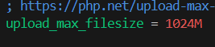
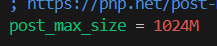
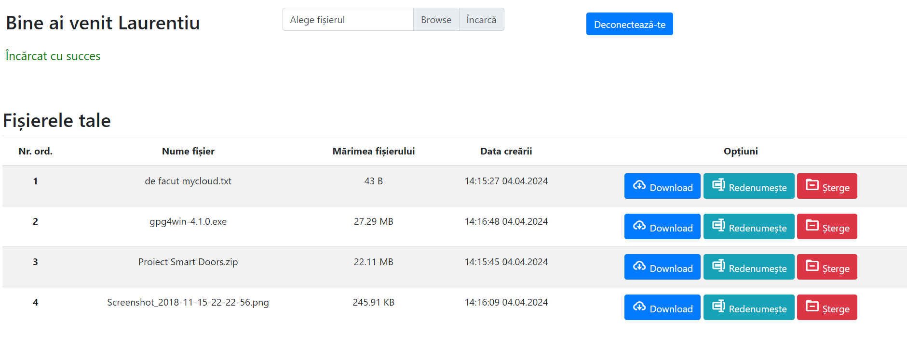
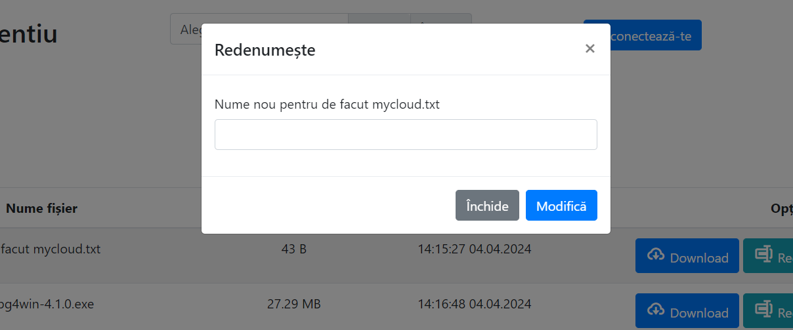

# HalleyMyCloud

## Install instructions:
### `docker-compose up -d`

# Config MyCloud to accept bigger files
### Enter php server container using command
`docker exec -it site bash`
### Go to default php config dir using command
`cd /usr/local/etc/php/`
### In the file `php.ini` search for the *post_max_size* and *upload_max_filesize*
 

###

### If `php.ini` does not exist use `php.ini-development` or `php.ini-production` then copy that file in the same dir as `php.ini` using command
`cp php.ini-development php.ini`
### Or
`cp php.ini-production php.ini`
## Don't forget to restart the php server
`docker restart site`

# Some screenshots of the project:

### Login page

### Home page

### Confirm rename file modal

### Confirm delete file modal
